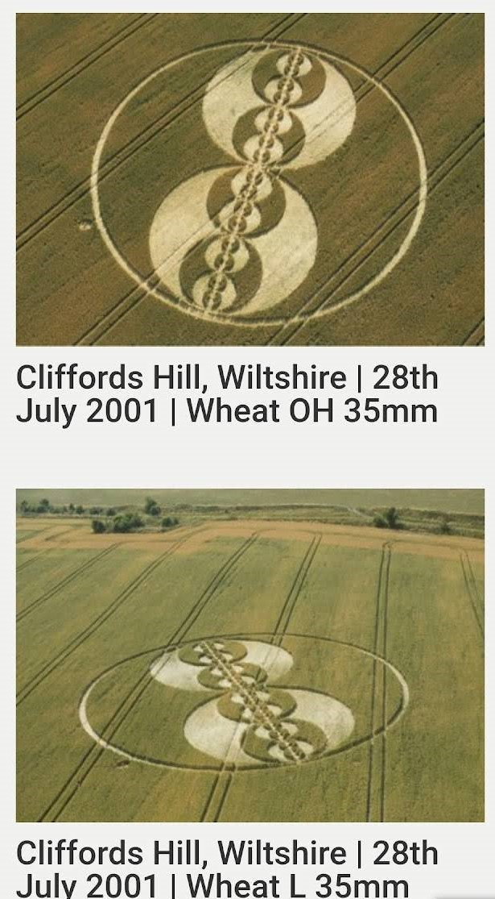

# La Revolució del Model Electroatòmic
El contingut d'aquesta publicació ofereix una revisió de l'evolució dels models atòmics al llarg de la història i posa de manifest la importància de construir un "Sistema Periòdic" (SP) d'electroatoms en lloc del model planetari Rutherford-Bohr actual. En aquest nou enfocament, un únic "electroatom" és la partícula elemental indivisible, i el sistema periòdic es construeix basant-se en la densitat elèctrica volumètrica dels electroatoms. El contingut també fa èmfasi en què l'electricitat i la matèria elèctrica s'haurien de considerar com una substància elèctrica autoorganitzada i discreta, en lloc de partícules separades.

En resum, el model Rutherford-Bohr actual i altres models atòmics són insuficients, i s'hauria de construir un nou Sistema Periòdic d'electroatoms per a una comprensió més precisa i completa de la naturalesa elèctrica. L'enfocament proposat promet proporcionar una teoria de camp unificada que concordi amb la realitat i no es basi en suposicions o conjectures no verificables.

# Introducció
Al llarg de la història de la ciència, el model de l'àtom ha experimentat diverses modificacions i propostes. Des dels primers intents per comprendre l'estructura dels àtoms al segle XIX fins als models més moderns basats en la mecànica quàntica, els científics han buscat precisió i una comprensió profunda de la partícula més petita de matèria.

En aquest article, explorarem una visió revolucionària del model electroatòmic basada en el Sistema Periòdic RUS (Equivalent Estable), un enfocament que es basa en la distribució autodidacta d'electroatoms en períodes (homogenis) i files (heterogenis), i proposa una interpretació distinta de l'electricitat i les partícules elementals.

# Origen dels Models Atòmics
Des del segle XIX fins a principis del segle XX, diferents científics van proposar models per descriure l'estructura dels àtoms. El 1902, J.J. Thomson va presentar un model en què la càrrega positiva estava distribuïda uniformement a tot l'àtom, i els electrons "flotaven" dins d'aquesta esfera. D'altra banda, F. Lenard va suggerir que no hi havia electrons separats i càrregues positives a l'àtom.

El 1904, H. Nagaoka va proposar el model atòmic d'anells d'electrons negatius al voltant d'un centre carregat positivament. Després, el 1912, E. Rutherford va utilitzar el terme "nucli" per primera vegada, i es va establir el model planetari Rutherford-Bohr, que ara s'ensenya a la majoria dels llibres de text.

# Hipòtesis Moleculars de Jean Perrin
No obstant això, és interessant destacar que el 1901, el científic francès Jean Perrin, no Rutherford, va proposar una hipòtesi en què un nucli carregat positivament estava envoltat d'electrons negatius que es movien en òrbites determinades. Aquesta idea, expressada al seu article "Hipòtesis Moleculars", presentava una estructura atòmica similar a la que s'ensenya avui.

# Convencions de Càrrega i l'Electró
Cal assenyalar que les convencions "+ i -" en l'electricitat van ser introduïdes per B. Franklin al segle XVIII, però l'electró, considerat una càrrega negativa fonamental, mai es va descobrir com a tal. J. Thomson simplement va suggerir l'existència d'una "certa partícula" amb un signe negatiu mentre estudiava els raigs X.

# El Model Electroatòmic RUS
El model electroatòmic RUS, desenvolupat basant-se en el Sistema Periòdic RUS, presenta una concepció radicalment diferent dels àtoms i l'electricitat. En aquest enfocament, els electroatoms es consideren les partícules elementals més petites de la matèria i no tenen estructura interna.

El Sistema Periòdic RUS es construeix mitjançant una dependència periòdica de la densitat elèctrica volumètrica dels electroatoms, organitzada segons un sistema de comptat binari. Cada electroatom posterior al període conté el precedent i difereix d'ell en la seva estructura, determinant el canvi de les seves propietats en el període. Aquest model cerca una veritable "Teoria de Camp Unificada" que concordi amb les realitats de la natura a tots els nivells de coneixement.

# El Sistema Periòdic RUS i Discrepàncies en el SP
Una de les principals crítiques al model clàssic del SP (Sistema Periòdic) és la disposició dels àtoms segons els pesos atòmics, la qual no resisteix certes crítiques. Per exemple, al segon període, apareixen discrepàncies entre la teoria i la realitat sota condicions normals, on els elements Li, Be, B, C, N, O, F, Ne són més lleugers que els gasos que els segueixen.

L'error en la disposició dels àtoms en el SP de 1869 i 1906 segons la llei d'Avogadro-Gerard, que va determinar la relació entre el nombre d'àtoms i molècules, ha estat un dels obstacles per entendre la naturalesa elèctrica.

# La Substància Elèctrica Autoorganitzada
El model electroatòmic RUS proposa que l'electricitat no es pot dividir en partícules elementals separades i que la matèria elèctrica és una substància elèctrica autoorganitzada i discreta. A més, suggereix que les diferències en les propietats dels electroatoms es deuen a l'organització de la seva estructura elèctrica i no a la quantitat de partícules elementals.

# Conclusions
El model electroatòmic RUS ofereix una perspectiva revolucionària sobre l'estructura de la matèria i l'electricitat, presentant una interpretació que cerca una teoria de camp unificada més propera a les realitats de la natura. Tot i que el model de Rutherford-Bohr ha estat fonamental en la comprensió històrica de l'àtom, l'abordatge RUS ens convida a reconsiderar i qüestionar les nostres concepcions actuals.

A mesura que la ciència continua avançant, és essencial mantenir una ment oberta i estar disposat a abraçar nous paradigmes que puguin sorgir, permetent-nos aprofundir en la comprensió de l'estructura íntima de la realitat. El model electroatòmic RUS ens mostra que encara hi ha molt a descobrir i explorar en el fascinant món de la ciència.

Aquí tens la llista completa de formes atòmiques: [https://electroatom.github.io/cat/](https://electroatom.github.io/cat/).

Raúl Peláez © 2023 Tots els drets reservats.

...
